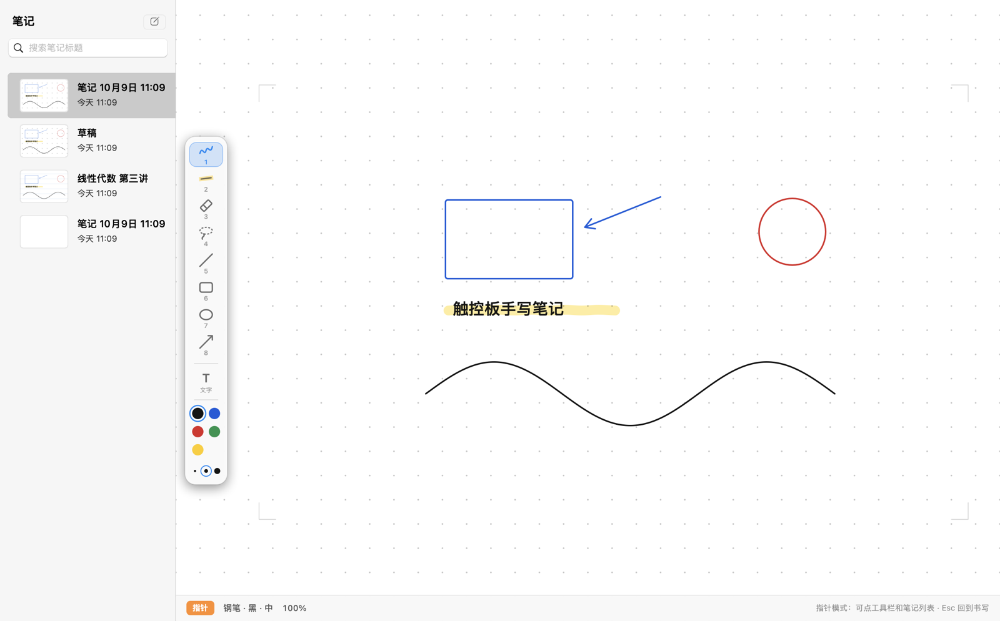
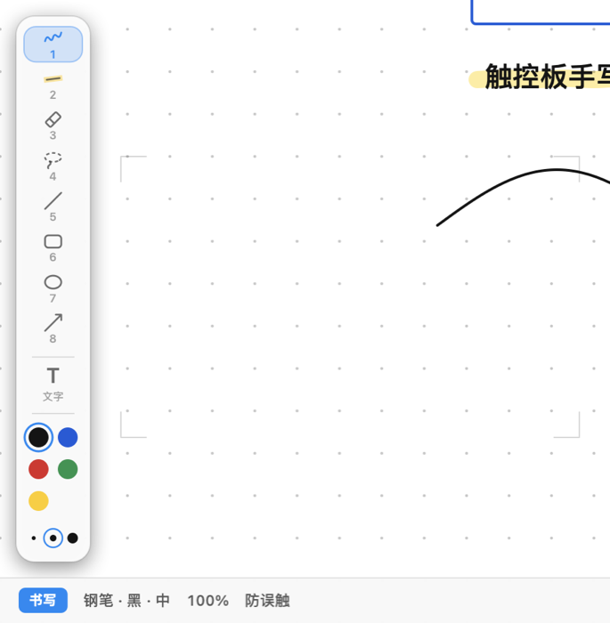

# Mac Trackpad Notes

**No room for an iPad on the desk, or can't be bothered to grab one? Pick up a cheap capacitive stylus and write straight on your MacBook's trackpad.**

[中文](README.md)



The whole trackpad maps onto the writing area of the canvas: wherever the tip touches is where the ink goes. Palm rejection tells the pen tip, fingers and palm apart by contact shape, so your wrist can rest on the pad while you write.

Made for quick, simple writing: working through a problem, a rough sketch, a few keywords, marking up what's on screen. It does not replace an iPad with Apple Pencil for fine work; it wins by needing no extra device and no desk space.

The interface is in Chinese.

## Features

- **Notes over anything**: press **⌃⌥N** (Control + Option + N) for a mini window that floats over every app, full-screen ones included (web pages, videos, slides). Press it again to put it away; it saves automatically. Drag and resize it; it remembers where it was.
- **Palm rejection**: reads each contact's shape (size, major/minor axis) and lets only the pen tip ink.
- **Two ways to start a stroke**: ink on contact, or "a light touch only shows where the tip is, a press writes".
- **Tools**: pen, highlighter, eraser (partial or whole stroke), lasso (select, move, recolor, delete), line, rectangle, ellipse, arrow, text; 5 colors, 3 widths.
- **Note library** with thumbnails, search and autosave; blank, ruled, grid or dot paper.
- **Export** to vector PDF or PNG; drop or paste images in.
- **Local only**: notes stay on your Mac, nothing goes online.



## Requirements

- A MacBook with Apple silicon (M1 or later), macOS 13 or later. Intel Macs are not supported.
- A **passive capacitive stylus** (conductive fiber or clear disc tip; no Bluetooth, no charging). If yours has a thick tip and is taken for a finger, widen the pen-tip range in the app (see the usage guide).

## Install

1. Download the latest `.dmg` from [Releases](../../releases) and drag "Trackpad Studio 手写.app" into Applications.
2. The first launch says the developer cannot be verified: the app has no paid Apple signature. Click "Done", then open System Settings → Privacy & Security, scroll down and click "Open Anyway". If that fails, run this, then open the app again:
   ```bash
   xattr -dr com.apple.quarantine "/Applications/Trackpad Studio 手写.app"
   ```
3. Grant **Input Monitoring** (palm rejection and writing in the mini window need it): System Settings → Privacy & Security → Input Monitoring, switch it on, then quit (⌘Q) and reopen.

## Shortcuts

| Action | Key |
|---|---|
| Show / hide the mini window anywhere | ⌃⌥N |
| Writing ⇄ pointer mode (click the list, drag the window) | Esc |
| Pen / highlighter / eraser / lasso / line / rectangle / ellipse / arrow | 1 – 8 |
| Next color / width | C / W |
| Undo / redo | ⌘Z / ⇧⌘Z |
| New note | ⌘N |
| Export PDF / PNG | ⌘E / ⇧⌘E |

## Build from source

```bash
xcode-select --install   # once: command line tools
scripts/deploy.sh        # build and install into ~/Applications
scripts/make-dmg.sh 1.0  # dist/TrackpadStudio-Handwriting-1.0.dmg
```

Test commands are in [AGENTS.md](AGENTS.md).

## Tuning it to your hand and pen

The palm-rejection thresholds were calibrated on the author's hand and pen from real recordings. Open this repository in an AI coding assistant (Claude Code, Codex, Cursor…) and say what doesn't work, e.g. "two-finger panning is often not recognized". It follows [AGENTS.md](AGENTS.md): asks you to record a few touch sessions, adjusts the thresholds from the data and verifies them. `calibration/reference/` holds the author's recordings, used to check nothing regressed.

## Known limits

- A capacitive trackpad cannot sense a hovering tip, so there is no hover preview; the light-touch mode is the workaround.
- It uses private macOS interfaces (MultitouchSupport for contact shapes, a window-server property to hide the pointer while another app is in front), so it cannot go on the App Store and may need updating after major macOS releases.
- Pressure sensing depends on the trackpad reporting pressure and needs a one-time calibration in the app.

## Credits and license

Based on [Trackpad Studio](https://github.com/ZaynJarvis/trackpad-studio) by Zayn Jarvis (MIT). Released under the [MIT License](LICENSE).
